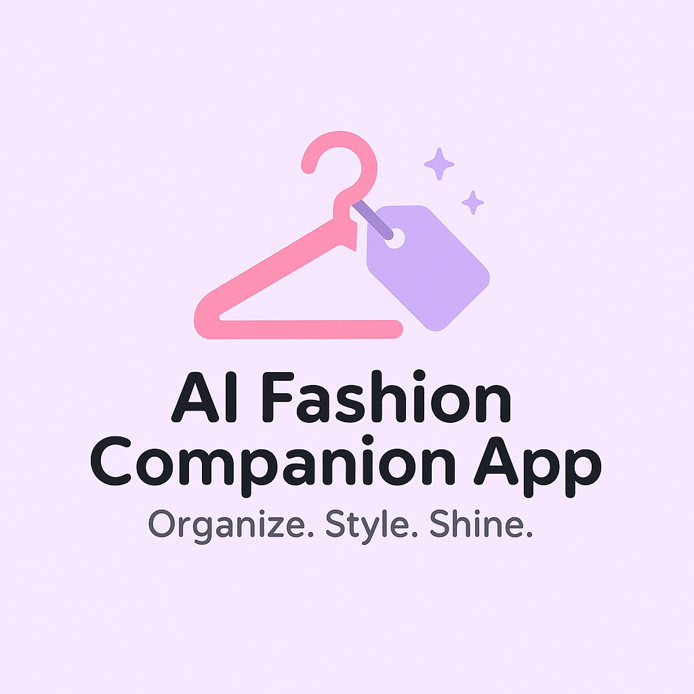

<p align="center">
  
</p>

<h1 align="center">AI Fashion Companion App</h1>
<p align="center"><b>A smart, AI-powered wardrobe organizer and stylist assistant</b><br>
Helping you dress better, shop smarter, and live more sustainably.</p>


## 🖼️ Demo

Here’s a quick look at the AI Fashion Companion in action:


## 📌 Overview

With the rapid rise of fast media like TikTok and live-selling platforms, it’s easy to lose track of our wardrobe and buy clothing we don’t need — often worn only once or twice. The **AI Fashion Companion App** helps users:

Digitally organize their clothing, accessories, and shoes.

Understand and utilize their existing wardrobe more effectively.

Get personalized outfit recommendations based on weather, occasion, and trends.

Avoid buying duplicate or unnecessary items through intelligent image-based search.

This app promotes **financial awareness** and **sustainable fashion habits** and ***CONFIDENCE***, addressing real-world behaviors many of us (like my sister!) fall into.

---
## 🛠️ Tech Stack & Architecture
- **Frontend**: Flutter (Dart)

- **Backend**: Django + Django REST Framework (Python)

- **Task Queue**: Celery + Redis
- **Cloud**: Firebase (Auth, Firestore, Storage)

- **Database**: Firebase Firestore

- **Vector Search**: Qdrant


## LLM / Vision Models

Ollama, HuggingFace models: 

- YOLO World for open-word detection, 

- SAM Mobile for segmentation

- Moondream for captioning

- CLIP for embeddings

- Gemma3 for outfit generation and RAG


## ⚙️ Installation & Setup

### 1. Clone the Repo

```bash
git clone https://github.com/Avitra2002/AIFashionCompanion.git
```
### 2. Flutter Frontend

```bash
cd flutter_frontend_app
flutter pub get
flutter run
```
✅ Use an emulator or connect an Android phone.

### 3. Django Backend
```bash
cd fashion_backend
python -m venv venv
source venv/bin/activate
pip install -r requirements.txt
python manage.py migrate
python manage.py runserver

```
### 4. Background Services
- Redis must be running (locally or via Docker).

- Run Celery Worker (run in a separate terminal):

```bash
celery -A fashion_backend worker --loglevel=info --pool=solo
```
### 5. Qdrant Vector DB (via Docker):

```bash
docker run -p 6333:6333 -p 6334:6334 -v qdrant_data:/qdrant/storage qdrant/qdrant
```
### 6. Firebase Setup
- Upload your firebase_service_key.json in the backend folder
- Update firebase_utils.py with the correct path to your service key
- Firebase is used for:
    - 🔐 Auth
    - 🗃 Firestore
    - 🗂 Storage

### 6. LLM & Vision Models
- Models used: gemma:4b, CLIP, YOLO World, SAM Mobile, Moondream
- Hosted locally with Ollama
([Ollama installation guide](https://ollama.com/download))

To run locally:

```bash
ifconfig | grep inet  # Get local IP

# Start Ollama Server
OLLAMA_HOST=0.0.0.0 ollama serve
```


## ✨ Features

### Security
🔐 Firebase Auth (sign in / anonymous)

### Closet Organization
- 📸 Upload clothing images (background removed, classified, segmented)

- 🗂 Auto-tagging: category, season, color, style

- 🧠 Image-to-vector pipeline using CLIP

- 🧾 Text descriptions for similarity search

- 🧥 Closet grid view with filters

### Outfit Recommendations
- 🌤 Daily outfit suggestions based on location and weather
- AI-generated looks (casual, dressy, etc.)
- 💾 Save and revisit outfit collections

### Occassion-Based Styling (Chatbot)

- 🧠 Chatbot for styling help ("What should I wear to a beach party?")
- Vector search using text embeddings + Gemma LLM
- Outfit collections generated using image-text similarity

### 🛍 Smart shopping assistant
- Take/upload a photo and check if you already own something similar
- Run through object detection, background removal, CLIP

- Compare with existing closet items using vector search

- Top 3 visually similar items returned


> 🔎 **Why separate CLIP text and image matching?**  
> Each clothing image had both text vector (from description generated) and image vector (from the image itself)

> I chose to keep image-only vector comparison for shopping to avoid bias from generic text labels and ensure precise visual matching — replicating the behavior of tools like Google Lens, but tailored to personal closets.


## 🧪 Skills Learned
- Built a **full stack** application integrating: 
    - Flutter app development with Dart (UI, routing, API integration)

    - Django REST API development (serializers, views, models)

    - Asynchronous task management using Celery

    - Redis queue management

    - Firebase integration (Auth, Firestore, Storage)

    - Vector search & similarity ranking using Qdrant

    - LLM integration (Ollama, HuggingFace APIs)

    - Image segmentation (SAM), detection (YOLO-World), and vision-language (CLIP)

- Hands on experience with AI-RAG (Retrieval Augmented Generation) pipelines and vector search systems

## 😰 Challenges Faced
| Challenge | Solution | Future |
| --- | --- | --- |
| Inference Latency running large models like Gemma 4B locally (Mac) caused slow responses | Optimized with Ollama, used smaller models, structured async requests | Explore quantized models and parallelization; shift to GPU/cloud inference |
| Image similarity for fashion was too generic | Used object detection + segmentation before embedding; separate pipelines for image and text vectors | Fine-tune CLIP on fashion datasets (e.g. Salesforce’s FashionBERT); add reranking |
| RAG output too generic for occasions | Added metadata filters and outfit types | Use user profiles + style weights to personalize RAG |
| Complex AI pipeline caused lag | Offloaded heavy tasks to Celery background jobs | Explore concurrent AI tasks and async optimization |


## 🔮 Future Plans
- 🔁 Improve retrieval system using rerankers, fashion-specific fine-tuned encoders and feedback loops for better search results

- Fine-tune LLMs and encoders for fashion-specific datasets (e.g., Salesforce BLIP for clothing)

- 🔥 Speed up AI processing through parallel async tasks

- 👗 Virtual try-on using user's photo (e.g., [Google AI Try-On](https://labs.google/doppl), [Google Shopping Virtual Try-On update](https://blog.google/products/shopping/google-shopping-ai-mode-virtual-try-on-update/))

- 📊 User profile-based personalization via multiple-choice style quizzes for RAG Chatbot response

- 🧑‍💼 Expand Auth to include full login + sign-out features (currently anonymous login)

- 💬 Richer chatbot experience with memory and dynamic outfit creation

- Web Crawl for shopping eg. pull from H&M website


## ☁️ Future Deployment Strategy:

1. Frontend via Firebase Hosting or Vercel

2. Backend via Docker on Render, Heroku, or AWS ECS/Fargate

3. Redis + Qdrant: Use managed Qdrant Cloud or deploy via Docker on EC2
4. Shift to API-based LLMs or containerized inference on GPU-backed server.

5. CI/CD via GitHub Actions

## 📝 License

MIT License

## 🙋‍♀️ Contact

Built by [Avitra](https://github.com/Avitra2002).  
Feel free to connect or reach out on [LinkedIn](www.linkedin.com/in/avitraphon/).

## 🤝 Contributions

This is a personal project for learning and growth. Feel free to fork or give feedback!